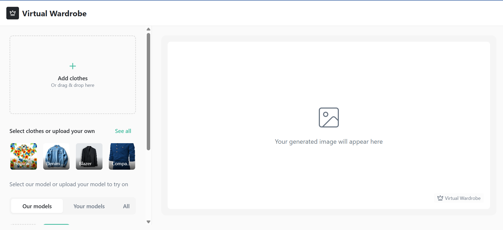

# 👗 Virtual Wardrobe - Style Your Closet

A modern virtual wardrobe and styling application powered by **nano banana Gemini 2.5 flash image** technology that lets you upload photos of your clothes and mix and match them to create amazing new outfits. Build your digital closet, experiment with different combinations, and discover new styling possibilities using advanced AI image processing!

## 📸 Screenshot



*The Virtual Wardrobe interface showing clothing selection and model preview areas*

## ✨ Features

- **📸 Upload Your Clothes**: Take photos of your garments and add them to your virtual closet
- **🎨 Mix & Match**: Create unlimited outfit combinations from your wardrobe  
- **👤 Virtual Try-On**: See how different pieces look together using nano banana Gemini 2.5 flash image processing
- **💾 Save Outfits**: Keep track of your favorite combinations
- **📱 Responsive Design**: Works perfectly on desktop and mobile devices
- **🌙 Modern UI**: Clean, intuitive interface built with shadcn/ui components
- **🤖 AI-Powered**: Advanced Gemini 2.5 flash image technology for realistic clothing visualization

## 🚀 Getting Started

### Prerequisites

- Node.js (v16 or higher)
- npm or yarn
- Google Gemini API key (free at https://aistudio.google.com/app/apikey)

### Installation

1. **Clone the repository**
   ```bash
   git clone https://github.com/yourusername/virtual-wardrobe.git
   cd virtual-wardrobe
   ```

2. **Install dependencies**
   ```bash
   npm install
   ```

3. **Set up environment variables**
   ```bash
   # Copy the example environment file
   cp .env.example .env
   ```
   
   Then edit the `.env` file and add your Google Gemini API key:
   - Get your free API key from: https://aistudio.google.com/app/apikey
   - Replace `your_gemini_api_key_here` with your actual API key

4. **Start the development server**
   ```bash
   npm run dev
   ```

5. **Open your browser**
   Navigate to `http://localhost:8080` to start using the app!

## 🛠️ Built With

- **Frontend Framework**: React 18 with TypeScript
- **Build Tool**: Vite
- **Styling**: Tailwind CSS
- **UI Components**: shadcn/ui
- **Icons**: Lucide React
- **State Management**: React Context API
- **Routing**: React Router DOM

## 📁 Project Structure

```
virtual-wardrobe/
├── src/
│   ├── components/          # Reusable UI components
│   │   ├── ui/             # shadcn/ui components
│   │   ├── ClothingSelector.tsx
│   │   ├── ModelSelector.tsx
│   │   └── PreviewArea.tsx
│   ├── context/            # React context providers
│   ├── data/               # Static data and configurations
│   ├── hooks/              # Custom React hooks
│   ├── pages/              # Page components
│   ├── utils/              # Utility functions
│   └── assets/             # Images and static assets
├── public/                 # Static files
└── ...config files
```

## 🎯 Usage

1. **Add Your Clothes**: Click the upload button to add photos of your garments
2. **Categorize Items**: Organize your clothes by type (tops, bottoms, shoes, etc.)
3. **Create Outfits**: Mix and match different pieces to create new outfits
4. **Preview Combinations**: See how your selected items look together
5. **Save Favorites**: Keep track of outfits you love for easy access later

## 🤝 Contributing

We welcome contributions! Please follow these steps:

1. Fork the repository
2. Create a feature branch (`git checkout -b feature/AmazingFeature`)
3. Commit your changes (`git commit -m 'Add some AmazingFeature'`)
4. Push to the branch (`git push origin feature/AmazingFeature`)
5. Open a Pull Request

### Development Guidelines

- Follow the existing code style and conventions
- Write clear, descriptive commit messages
- Add tests for new features when applicable
- Update documentation as needed

## 📝 Scripts

- `npm run dev` - Start development server
- `npm run build` - Build for production
- `npm run preview` - Preview production build
- `npm run lint` - Run ESLint

## 🐛 Issues & Support

If you encounter any issues or have questions:

1. Check existing [Issues](https://github.com/yourusername/virtual-wardrobe/issues)
2. Create a new issue with detailed information
3. Include steps to reproduce any bugs

## 📄 License

This project is open source and available under the [MIT License](LICENSE).

## 🎉 Acknowledgments

- Thanks to the shadcn/ui team for the amazing component library
- Built with modern React and TypeScript best practices
- Inspired by the need for better digital wardrobe management

---

**Start building your virtual wardrobe today!** 👔👗👠